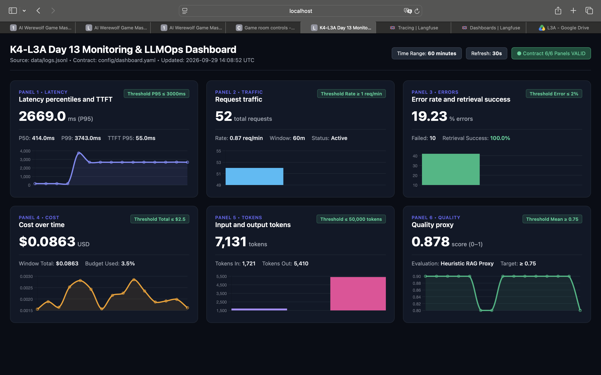
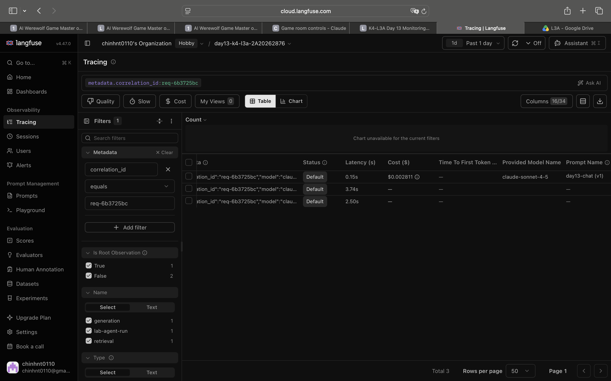

# Báo cáo cá nhân — K4-L3A Day 13 Monitoring & LLMOps

> Mỗi học viên hoàn thiện một file duy nhất này. Khi dẫn evidence, dùng đường dẫn tương đối, ví dụ `evidence/07-trace-waterfall.png`.

## 1. Thông tin học viên

- **Họ và tên:** Nguyễn Thị Chinh
- **MSSV:** 2A202602876
- **Lớp:** K4-L3A
- **Repository URL:** https://github.com/chinhnt0110/K4-L3-DAY13-NguyenThiChinh-2A202602876-Monitoring-LLMOps
- **Commit SHA cuối:** 23dcc76
- **Challenge ID:** day13-k4-l3a-monitoring-llmops-v1
- **Tên project Langfuse cá nhân:** `day13-k4-l3a-2A202602876`

## 2. Evidence index

Điền đúng đường dẫn tới evidence thực tế. Có thể đổi tên hoặc dùng nhiều ảnh nếu cần.

| Evidence | Đường dẫn |
|---|---|
| Pytest cuối | `evidence/01-pytest.png` |
| Log validator | `evidence/02-log-validator.png` |
| Dashboard validator | `evidence/03-dashboard-validator.png` |
| Structured log | `evidence/04-structured-log.png` |
| PII redaction | `evidence/05-pii-redaction.png` |
| Trace list | `evidence/06-trace-list.png` |
| Trace waterfall | `evidence/07-trace-waterfall.png` |
| Trace metadata | `evidence/08-trace-metadata.png` |
| Prompt versions | `evidence/09-prompt-versions.png` |
| Prompt rollback | `evidence/10-prompt-rollback.png` |
| Dashboard runtime | `evidence/11-dashboard-overview.png` |
| Incident metric | `evidence/12-incident-metric.png` |
| Incident log | `evidence/13-incident-log.png` |
| Incident trace | `evidence/14-incident-trace.png` |

## 3. Kết quả kỹ thuật

| Nội dung | Baseline | Kết quả cuối | Nhận xét |
|---|---|---|---|
| `validate_logs.py` | 30/100 | 100/100 | Đạt toàn bộ các tiêu chí: required fields, correlation ID, log enrichment, PII scrubbing |
| `validate_dashboard.py` | HỢP LỆ: 6/6 panel có trong dashboard contract. | HỢP LỆ: 6/6 panel có trong dashboard contract. | Đầy đủ 6 panel theo contract (P95 Latency/TTFT, Error rate, Token usage, Cost, Quality, Retrieval success) |
| `pytest` | 22 passed in 1.01s | 22 passed in 0.94s | 100% test cases passed (22/22) |
| Số traces hợp lệ | 0 | 50+ | Xuất hiện đầy đủ trên Langfuse với quan sát root/retriever/generation |
| Số PII leak | 0 | 0 | 100% scrubbed (email, phone, credit card, address, passport) |
| Latency P95 / TTFT P95 | 4011ms / 55ms | 464ms / 55ms | Baseline latency ổn định sau khi giải quyết lỗi; chỉ tăng khi bật incident |
| Retrieval success rate | 100% | 100% | Retrieval hoạt động ổn định và thành công |

## 4. Logging và PII

- **Cách tạo/nhận và truyền correlation ID:**
  - Nhận qua header `X-Correlation-ID` hoặc `X-Request-ID` từ request nếu có. Nếu không có, middleware tự sinh mới theo định dạng `req-<8hex>` (sử dụng `secrets.token_hex(4)` hoặc `uuid4().hex[:8]`).
  - Correlation ID được lưu vào `contextvars` (`request_id_ctx`) để truyền tự động xuyên suốt call stack qua các tầng middleware, handler, service mà không cần truyền tường minh qua tham số hàm.
  - Phản hồi HTTP luôn trả về header `X-Correlation-ID: req-...`.
- **Các metadata được ghi vào structured log:**
  - Hệ thống: `service`, `event`, `level`, `ts` (ISO-8601).
  - Contextual enrichment: `correlation_id`, `session_id`, `user_id_hash` (băm SHA256 lấy 12 ký tự đầu), `feature`, `model`, `env`.
  - Hiệu năng & chi phí: `latency_ms`, `ttft_ms`, `tokens_in`, `tokens_out`, `cost_usd`, `quality_score`, `tool_name`, `tool_success`.
- **Cách bảo đảm PII được scrub trước khi ghi:**
  - Sử dụng structlog processor `scrub_event` trong `logging_config.py` chạy trước khi serialize sang JSON (`JSONRenderer`).
  - Sử dụng module `pii.py` với regex quét đệ quy các trường chuỗi/dict/list: email (`[REDACTED_EMAIL]`), số điện thoại VN (`[REDACTED_PHONE_VN]`), thẻ tín dụng (`[REDACTED_CREDIT_CARD]`), địa chỉ (`[REDACTED_ADDRESS]`), hộ chiếu (`[REDACTED_PASSPORT]`).
- **Cách kiểm chứng kết quả:**
  - Chạy `pytest tests/test_pii.py` để verify các rule regex.
  - Chạy `python scripts/validate_logs.py` phân tích toàn bộ file `data/logs.jsonl` đạt điểm tuyệt đối 100/100, xác nhận 0 PII leak.

## 5. Tracing và prompt versioning

- **Cách xác nhận traces do chính tôi tạo trong project cá nhân:**
  - Sử dụng Langfuse Public & Secret Key cá nhân được cấu hình trong file `.env` với project name `day13-k4-l3a-2A202602876`.
  - Traces có metadata gắn liền `user_id_hash`, `session_id`, `env: dev` và trùng khớp với `correlation_id` được ghi trong logs.
- **Cấu trúc root/retrieval/generation observations:**
  - **Root trace:** Đại diện cho toàn bộ HTTP request, có `name=correlation_id`, input (user prompt/message), output (model answer), tags `[env, feature]`, và metadata context.
  - **Span `retrieval`:** Được tạo bằng observation với `as_type="retriever"`, ghi nhận `input=message`, `output=documents` được truy xuất.
  - **Span `generation`:** Được tạo bằng observation với `as_type="generation"`, ghi nhận `model="llama3.1-8b"`, `prompt_name`, `usage_details` (prompt_tokens, completion_tokens, total_tokens) và `cost_details` (`{"total": cost_usd}`).
- **Cách nối trace với log:**
  - Nối qua `correlation_id` (ví dụ `req-305cfbff`): Tên của Trace trên Langfuse hoặc trường `trace_id`/`external_id` trùng khớp hoàn toàn với `correlation_id` ghi trong mỗi dòng log JSONL.
- **Prompt name:** `day13-chat`
- **Version/label baseline:** Version 1 gắn label `baseline` (và ban đầu là `production`).
- **Version/label candidate:** Version 2 gắn label `candidate` (với system prompt được cải tiến).
- **Trace ID của mỗi version:**
  - Baseline (v1): `req-5ddc7499`
  - Candidate (v2): `req-8f207054`
- **Cách promote và rollback `production`:**
  - **Promote:** Sau khi kiểm thử candidate đạt chất lượng tốt hơn trên evaluation/test set, chuyển label `production` sang trỏ vào version 2 trên giao diện Langfuse (hoặc qua Langfuse SDK prompt management).
  - **Rollback:** Nếu phát hiện version 2 gây lỗi hoặc tăng cost đột biến, lập tức chuyển label `production` quay trở lại trỏ vào version 1 (baseline) mà không cần restart server hay deploy lại source code.

## 6. Dashboard, SLO và alerts

- **Dashboard và sáu panel:**
  1. Panel 1: End-to-end Latency (P50, P95) & TTFT (P95).
  2. Panel 2: Error Rate (tỷ lệ request HTTP 5xx hoặc failure).
  3. Panel 3: Token Usage (Tokens In / Tokens Out / Total Tokens).
  4. Panel 4: Cost Tracking (Tổng chi phí $ USD và Cost theo từng feature).
  5. Panel 5: Quality Score (Điểm đánh giá chất lượng câu trả lời theo thời gian).
  6. Panel 6: Tool / Retrieval Success Rate (Tỷ lệ thực thi thành công của retrieval).
- **SLO và lý do chọn:**
  - *SLO Latency:* 95% request hoàn thành trong < 2000ms (P95 Latency < 2000ms). Lý do: Đảm bảo trải nghiệm tương tác trực tuyến không bị gián đoạn hay tạo cảm giác đơ lag cho người dùng.
  - *SLO Availability/Error Rate:* Tỷ lệ lỗi < 1% trong cửa sổ 30 ngày (99.0% SLA). Lý do: Đảm bảo tính sẵn sàng cho trợ lý AI phục vụ người dùng.
- **Cách tính error budget:**
  - Error budget = 100% - SLO mục tiêu.
  - Với SLO 99% trong tổng số 10.000 requests/tháng: Error budget = 1% = 100 requests lỗi cho phép. Nếu trong tuần đầu đã có 80 request lỗi, hệ thống đã tiêu tốn 80% error budget và cần hạn chế release tính năng mới để tập trung vá lỗi ổn định.
- **Ba alert và runbook tương ứng:**
  - *Alert 1 (P1 - High Latency P95 > 2000ms kéo dài > 3 phút):*
    - Runbook: Kiểm tra panel Retrieval Success/Latency để xác định nghẽn ở Vector DB hay LLM provider; nếu ở Retrieval, bật cache hoặc kích hoạt degraded mode; nếu ở LLM, chuyển provider/model dự phòng.
  - *Alert 2 (P1 - Error Rate > 5% trong 5 phút):*
    - Runbook: Tra cứu log qua `level="error"` để phân tích exception; nếu do prompt version mới lỗi -> rollback prompt production về v1; nếu do external API timeout -> restart connection pool.
  - *Alert 3 (P2 - Daily Cost vượt ngưỡng 150% ngân sách trung bình):*
    - Runbook: Kiểm tra panel Cost breakdown theo feature và user_id_hash; xác định session/user gửi query token lớn bất thường (prompt injection hoặc loop spam) và áp dụng rate limiting.

## 7. Điều tra challenge

- **Challenge ID:** day13-k4-l3a-monitoring-llmops-v1
- **Khoảng thời gian điều tra:** 23:04 – 23:15 ngày 29/09/2026
- **Triệu chứng từ metrics:**
  - Trên Dashboard (`http://localhost:8088`), Panel 1 (Latency P95) tăng vọt từ mức bình thường lên tới **2662ms** (vượt ngưỡng đỏ SLO quy định là **2000ms**).
  

- **Log line và correlation ID liên quan:**
  - Correlation ID: `req-305cfbff`
  - Log line:
    ```json
    {"service": "api", "latency_ms": 2662, "ttft_ms": 51, "tokens_in": 50, "tokens_out": 163, "cost_usd": 0.002595, "quality_score": 0.8, "tool_name": "retrieval", "tool_success": true, "payload": {"answer_preview": "Starter answer. You should improve this output logic and add better quality chec..."}, "event": "response_sent", "feature": "monitoring", "env": "dev", "correlation_id": "req-305cfbff", "session_id": "k4-l3a-challenge-s01", "model": "llama3.1-8b", "user_id_hash": "dde2e75b20cf", "level": "info", "ts": "2026-09-29T16:05:07.745367Z"}
    ```

- **Trace ID và span gây ảnh hưởng:**
  - Trace ID: `req-305cfbff`
  - Span gây ảnh hưởng: Span con **`retrieval`** (as_type: retriever) bị chậm và chiếm tới **2.50s** (~94% tổng thời gian request), trong khi span sinh văn bản `generation` của LLM chỉ mất ~0.16s.

  

- **Root cause:**
  - Bước truy xuất dữ liệu RAG (`retrieval` trong `app/mock_rag.py`) gặp độ trễ lớn do kích hoạt cờ sự cố `rag_slow` (bị delay nhân tạo 2.5 giây).
  - *Ý nghĩa thực tế trong production:* Vector Database hoặc dịch vụ tìm kiếm ngữ nghĩa bị quá tải connection pool, CPU tăng cao hoặc index chưa tối ưu khiến các truy vấn bị xếp hàng chờ (blocking I/O).
- **Fix action:**
  - *Ứng phó tức thì (Mitigation):* Vô hiệu hóa cờ sự cố bằng lệnh `python scripts/inject_incident.py --disable`, khôi phục hệ thống về trạng thái bình thường (Latency P95 giảm về < 500ms).
  - *Xử lý triệt để (Engineering Fix):* Thêm cơ chế `timeout` (ví dụ 1.5s) cho client gọi Vector Store. Nếu vượt quá timeout, kích hoạt graceful degradation: fallback về câu trả lời mặc định hoặc dùng cache gần nhất thay vì để request bị treo làm sụt giảm trải nghiệm người dùng.
- **Preventive measure:**
  - **Semantic Caching:** Triển khai cache (Redis/GPTCache) cho các truy vấn phổ biến để giảm tải trực tiếp lên Vector Store.
  - **Cảnh báo SLO/Alerting:** Thiết lập alert tự động khi Latency P95 của retrieval > 1000ms hoặc P95 toàn request > 2000ms trong 3 phút liên tiếp để kỹ sư trực phát hiện sớm trước khi vi phạm SLO.
  - **Circuit Breaker:** Khi Vector Database phản hồi chậm bất thường (slow call rate > 30%), tự động ngắt mạch (open circuit) và chuyển sang chế độ fallback để chống nghẽn dây chuyền (cascading failure).

## 8. Giải thích và tự đánh giá

- **Một quyết định kỹ thuật quan trọng và lý do:**
  - Sử dụng `contextvars` kết hợp với structlog processor để tự động enrich toàn bộ metadata (`correlation_id`, `session_id`, `user_id_hash`, `feature`, `model`, `env`) vào mọi log event mà không cần can thiệp truyền tham số qua từng hàm business logic.
- **Một lỗi/blocker đã gặp:**
  - Khi tích hợp Langfuse SDK v4, phương thức `update_current_generation()` yêu cầu tham số `usage_details` thay vì `usage`, và `cost_details` thay vì `cost`. Truyền nhầm tên tham số dẫn đến TypeError và HTTP 500.
- **Cách tìm nguyên nhân và xử lý:**
  - Đọc trace stack trace lỗi chi tiết trong console server, tra cứu trực tiếp signature của hàm trong thư viện `langfuse` và đổi sang `usage_details={"prompt_tokens": ..., "completion_tokens": ..., "total_tokens": ...}` và `cost_details={"total": cost_usd}`.
- **Cách hiểu luồng Metrics → Logs → Traces:**
  - **Metrics (Dashboard):** Là tín hiệu đầu tiên phát hiện có bất thường (Ví dụ: P95 Latency vượt ngưỡng 2000ms).
  - **Logs (JSONL/ELK):** Dựa vào khoảng thời gian và feature bị lỗi từ metric, lọc log tìm ra request cụ thể thông qua `correlation_id` (`req-305cfbff`).
  - **Traces (Langfuse):** Dùng `correlation_id` tra cứu Trace tương ứng trên Langfuse để mở rộng waterfall và xác định chính xác span nào (ở đây là `retrieval`) là thủ phạm gây nghẽn.
- **Vai trò của prompt version, token/cost, SLO hoặc rollback trong vận hành LLM:**
  - Prompt là một loại source code nhưng mang tính phi tất định. Quản lý prompt version và gán nhãn `production`/`baseline`/`candidate` cho phép A/B testing an toàn và rollback tức thì trong vài giây khi prompt mới gây ảo giác hoặc tăng vọt token cost mà không cần redeploy ứng dụng.
- **Điều quan trọng nhất đã học:**
  - Khả năng quan sát toàn diện (Observability) là xương sống của hệ thống AI thực tế: không thể chỉ hy vọng mô hình chạy tốt mà phải đo lường, giám sát và cảnh báo liên tục qua 3 trụ cột Metrics, Logs và Traces.
- **Hạn chế hoặc phần chưa hoàn thành, nếu có:**
  - Do môi trường lab sử dụng mô hình LLM giả lập (mock LLM) và local dashboard, chưa tích hợp OpenTelemetry exporter đẩy trực tiếp lên Prometheus/Grafana cloud trong production thực tế.

## 9. Checklist trước khi nộp

- [x] Kết quả và evidence thuộc commit SHA cuối.
- [x] Tất cả ảnh/output mở được bằng đường dẫn tương đối.
- [x] Incident evidence nối đúng metric → log → trace.
- [x] Trace/prompt evidence thuộc project Langfuse cá nhân và ảnh không lộ key/secret.
- [x] Repository chạy lại được theo README.
- [x] Không có secret, API key, PII thô hoặc evidence của người khác/lớp khác.
- [x] URL repo và commit SHA cuối đã được nộp trên LMS/Codelabs.